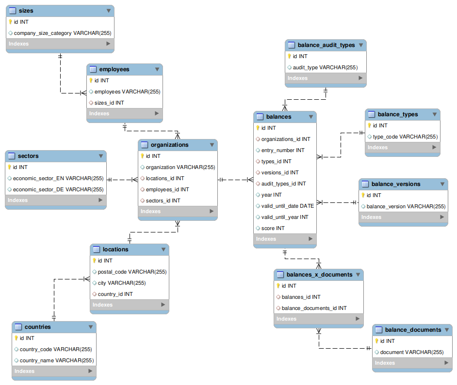

# Economy for the Common Good: Trends & Developments
Project started in January 2024.  
Project status: Ongoing.

## Scope
In this project, I analyze the status quo and trends within the economy for the common good (ECG) movement. For that, I aim to build a full data pipeline:
- Web-scraping publicly available data from companies that currently participate in the ECG
- Modeling the data into a relational database & building the database with MySQL
- Analyzing the data
- Visualizing key results in 1-2 interactive dashboards
- Automizing the pipeline utilizing Airflow.

## Tech used
- Python (web-scraping)
- SQL (MYSQL; modeling, analyses)
- Tableau (or similar visualization tool like Metabase - TBD; data visualization)
- Airflow (pipeline automatization)

## Database
The data stems from [this official website of the ECG movement](https://audit.ecogood.org/firmenauskunft-fvz/) that is frequently updated with new entries (balances, companies).

## Status quo
#### First results
- I successfully scraped the database and cleaned the data.
- I modeled the data (see below), built the relational database using MySQL, and successfully loaded the data into the MySQL server.

#### Next steps
Next on the agenda is to clean the web-scraping code (especially heavily hard-coded parts), conduct data analyses, build insightful dashboards, and automize the whole data pipeline.

## Collaboration
This is a pro bono project and I am happy to collaborate on it. If you are interested, don't hesitate to contact me.
